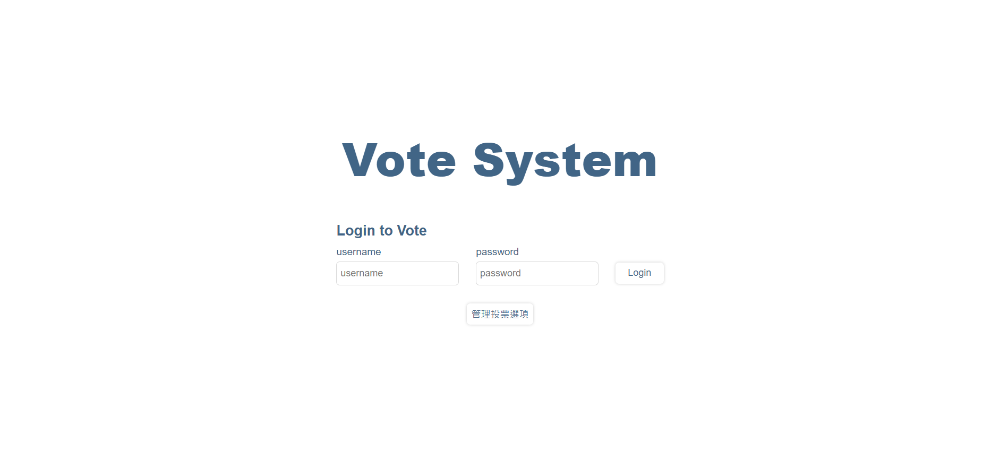

# 投票系統

## 檔案配置
* 後端: `/`
* 前端: `/vote_frontend`
* 資料庫: `/DB`

## 資料庫建立
DDL、DML 位於 `/DB` 資料夾下
* `DDL.sql`: 建立資料庫、資料表、預存程序
* `DML.sql`: 新增資料
  * 除指定資料表，額外新增一資料表來儲存使用者帳號密碼
* 可以到 `src\main\resources\application.properties` 更改 MySQL 的 port 和登入帳密

## 啟動專案
### 後端
* 下載 Maven
* 於資料夾根目錄 `/` 下指令: `mvn spring-boot:run`
* 伺服器於 http://localhost:8080 啟動

### 前端
* 下指令移動到前端資料夾: `cd vote_frontend`
* 下指令安裝: `yarn install`
* 下指令啟動: `yarn serve`
* 網頁於 http://localhost:3000 啟動

## 使用說明
### 首頁
* 點擊 `管理投票選項` 可前往選項管理頁
* 登入後可前往投票頁，使用者帳密可參考以下表格

|帳號(同使用者名稱)|密碼|
|  ----  | ----  |
|Leo|123|
|Sandy|234|
|Randy|345|
|RSY|456|

### 投票頁
* 可任意更改選票

### 管理頁
* 可新增、刪除、修改選項